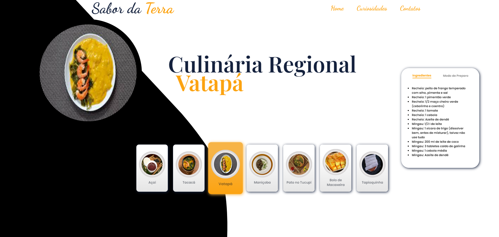

## Projeto de pratos regionais de Belém-PA

## Objetivo 
Criar uma página para praticar meus conhecimentos como desenvolvedor sem nenhum fim lucrativo diante dos conteúdos utilizandos no projeto 
## Sobre o Projeto
Este projeto visa criar uma página web para explorar e compartilhar a rica culinária da região paraense, utilizando HTML, CSS e JavaScript como prática para desenvolvimento web.

## Conteúdo
Página Inicial: Introdução à culinária paraense.
Seções de Receitas: Destaque para pratos típicos com receitas detalhadas.
Galeria de Imagens: Fotos de pratos e ingredientes regionais.
Seção de História e Cultura: Contexto cultural e histórico sobre a culinária paraense.

## Visão Geral 
Icones para selecionar o tipo de prato para ser exibido com painel de ingredientes e modo de preparo 

## Demostração

## Tecnologias Utilizadas

- **HTML:** 

- **CSS:** 

- **JAVASCRIPT:** 

